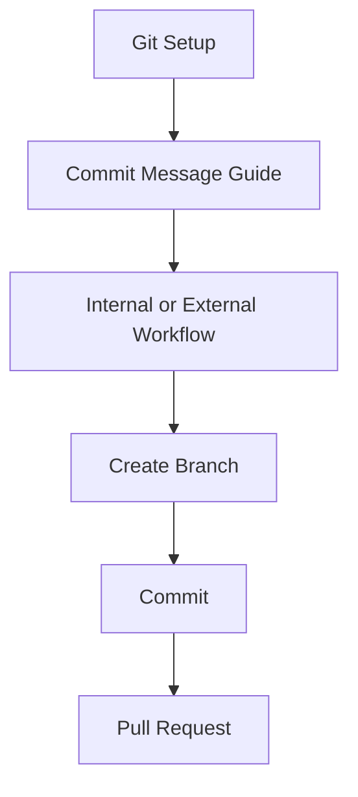
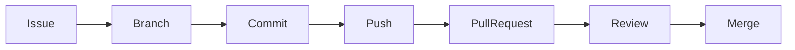

# Feature Branching Scenarios Index

This section contains practical Git workflows used in this repository.

---

# Getting Started

### Git Installation & Configuration

📖 [Git Setup and Configuration](./git-setup-and-configuration.md)

Learn:

- Install Git
- Configure username/email
- Configure SSH
- Clone repositories
- Useful Git commands

---

# Feature Branching

### Internal Contributors

📖 [Internal Contributors Guide](./feature-branching/internal-contributors.md)

For:

- Team members with repository access
- Creating feature branches
- Working with develop branch
- Creating Pull Requests
- Rebasing and resolving conflicts

---

### External Contributors

📖 [External Contributors Guide](./feature-branching/external-contributors.md)

For:

- Community contributors
- Forking repositories
- Creating feature branches
- Submitting Pull Requests

---

### Learn by Scenario wise

1. [Normal PR](./feature-branching/scenario/01-normal-pr.md)
2. [Handle Conflicts in PR](./feature-branching/scenario/02-handle-conflicts.md)
3. [Rebase in PR](./feature-branching/scenario/03-rebase-pr.md)

### If you are [developer read this.](./feature-branching/developer-workflow.md)

---

# Commit Guidelines

### Conventional Commits

📖 [How to Provide Commit Messages](./how-to-provide-commit-message.md)

Learn:

- feat
- fix
- docs
- refactor
- chore
- style
- test
- perf

---

# Learning Path

New contributor?

Follow this order:

---

# Repository Contribution Flow

---

# Quick Navigation

| Guide                       | Description                        |
| --------------------------- | ---------------------------------- |
| Git Setup and Configuration | Install and configure Git          |
| Internal Contributors       | Workflow for collaborators         |
| External Contributors       | Workflow for external contributors |
| Commit Message Guide        | Conventional commit standards      |

---

Happy Contributing 🚀

### Author:

[Anbuselvan Annamalai](https://fb.me/anburocky3)
