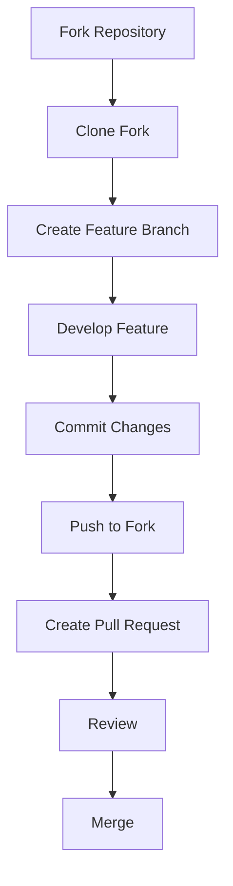
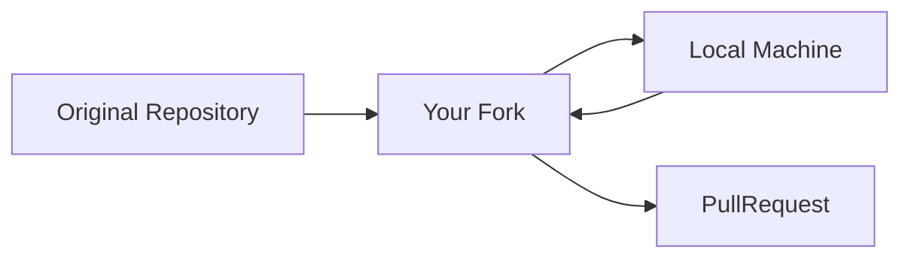
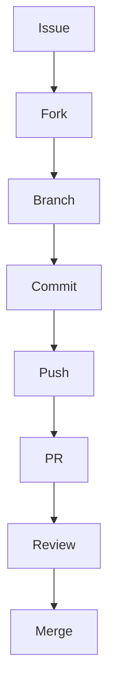
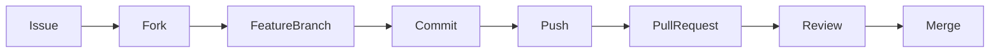

# External Contributors Guide

> For contributors who do not have write access to the repository.

---

# Purpose

External contributors should contribute using:

```text
Fork → Feature Branch → Pull Request
```

This keeps the repository secure while allowing community contributions.

---

# Contribution Workflow



---

# Before Contributing

Check for an existing issue.

Examples:

```text
#12 Design About Page
#13 Improve Accessibility
#14 Fix Mobile Navbar
```

If no issue exists:

Create one before starting work.

---

# Fork the Repository

Click:

```text
Fork
```

GitHub creates:

```text
Original Repository
        ↓
      Your Fork
```

Example:

```text
github.com/anbu/design-repo
```

becomes

```text
github.com/your-username/design-repo
```

---

# Clone Your Fork

```bash
git clone https://github.com/your-username/design-repo.git

cd design-repo
```

---

# Configure Upstream

Add original repository.

```bash
git remote add upstream https://github.com/anbu/design-repo.git
```

Verify:

```bash
git remote -v
```

Expected:

```text
origin      your fork
upstream    original repository
```

---

# Create Feature Branch

Never work directly on main.

```bash
git checkout main
git pull origin main

git checkout -b feat/12-about-page
```

---

# Branch Naming Convention

Format:

```text
<type>/<issue-number>-<feature-name>
```

Examples:

```text
feat/12-about-page
fix/14-navbar-responsive
docs/20-readme-update
refactor/25-header-component
```

---

# Conventional Commits

## Feature

```bash
feat: create about page (#12)
```

## Fix

```bash
fix: resolve navbar overlap (#14)
```

## Documentation

```bash
docs: update README
```

## Refactor

```bash
refactor: extract footer component
```

---

# Practical Example

Issue:

```text
#12 Design About Page
```

Branch:

```text
feat/12-about-page
```

Commit:

```bash
git commit -m "feat: create about page layout (#12)"
```

Push:

```bash
git push origin feat/12-about-page
```

Create PR:

```text
your-fork:feat/12-about-page
               ↓
upstream:develop
```

---

# Syncing Your Fork

Before starting new work:

```bash
git checkout main

git fetch upstream

git merge upstream/main

git push origin main
```

This keeps your fork updated.

---

# Contribution Diagram



---

# Pull Request Requirements

A pull request should:

- Solve a single issue
- Contain focused changes
- Include screenshots for UI changes
- Use conventional commits
- Reference the issue

Example:

```text
Closes #12
```

---

# Avoid These Mistakes

❌ Working directly on main

❌ Multiple features in one PR

❌ Force pushing shared branches

❌ Massive unrelated formatting changes

❌ Submitting code without an issue

---

# Recommended Open Source Flow



---

# Golden Rules

✅ Fork first

✅ Create feature branch

✅ Use issue numbers

✅ Submit one feature per PR

✅ Keep PRs small

❌ Never develop on main

❌ Never combine unrelated work

---

# Contribution Lifecycle


