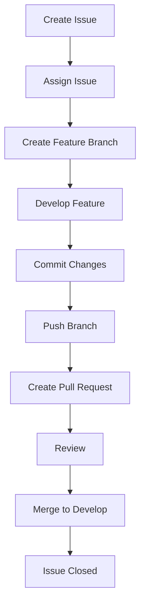
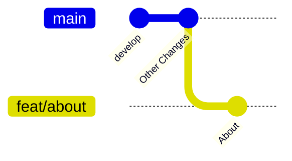
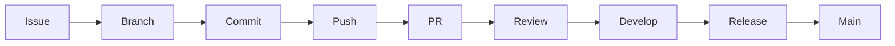

# Internal Contributors Guide

> For team members who have direct access to the repository.

---

# Purpose

This repository follows an Issue-Driven Feature Branching workflow.

Goals:

- Keep `main` stable
- Reduce merge conflicts
- Track all work through GitHub Issues
- Make code reviews easier
- Maintain clean Git history

---

# Team Workflow



---

# Branch Strategy

## Protected Branches

```text
main      → Production Ready
develop   → Active Development
```

Never push directly to:

```text
main
develop
```

All work must happen through feature branches.

---

# Issue First Development

Before writing code:

1. Create an issue
2. Assign it
3. Create a branch from the issue

Example:

```text
#12 Design About Page
#13 Design Contact Page
#14 Create FAQ Page
```

---

# Branch Naming Convention

Format:

```text
<type>/<issue-number>-<feature-name>
```

Examples:

```text
feat/12-about-page
feat/13-contact-page
fix/14-navbar-responsive
docs/15-contribution-guide
refactor/16-header-component
```

Avoid:

```text
new-feature
test
gokul-work
saran-final
```

---

# Create a Branch

Always start from latest develop.

```bash
git checkout develop
git pull origin develop
```

Create feature branch:

```bash
git checkout -b feat/12-about-page
```

Push:

```bash
git push -u origin feat/12-about-page
```

---

# Practical Example

## Scenario

Issue:

```text
#12 Design About Page
```

Assigned To:

```text
Gokul
```

Branch:

```text
feat/12-about-page
```

Commits:

```bash
git commit -m "feat: create about page layout (#12)"
git commit -m "feat: add responsive design (#12)"
```

PR:

```text
feat/12-about-page
      ↓
   develop
```

---

# Conventional Commits

## feat

New feature

```bash
feat: create about page
```

## fix

Bug fix

```bash
fix: resolve mobile navbar issue
```

## docs

Documentation

```bash
docs: update contributor guide
```

## refactor

Code improvements without feature changes

```bash
refactor: extract button component
```

## style

Formatting only

```bash
style: format code using prettier
```

## test

Tests

```bash
test: add login validation tests
```

## chore

Maintenance

```bash
chore: update dependencies
```

---

# Keeping Your Branch Updated

Suppose:

- Gokul finished About Page
- About Page merged into develop
- Saran is still working on Contact Page

Before Saran opens a PR:

```bash
git checkout develop
git pull origin develop

git checkout feat/13-contact-page

git rebase develop
```

Push rebased branch:

```bash
git push --force-with-lease
```

---

# Why Rebase?

Without rebase:

```mermaid
gitGraph
    commit id: "develop"
    branch feat/about
    checkout feat/about
    commit id: "About"
    checkout develop
    commit id: "Other Changes"
```

With rebase:



Cleaner history.

---

# Pull Request Guidelines

PR Title:

```text
feat: create about page
```

Description:

```text
Closes #12

Changes:
- Created About page layout
- Added responsive design
- Added mobile support
```

---

# Avoiding Merge Conflicts

## Good

```text
Gokul → About Page
Saran → Contact Page
```

Different files.

---

## Bad

```text
Gokul → Navbar
Saran → Navbar
```

Same file.

Conflict likely.

---

# Golden Rules

✅ One Issue → One Branch

✅ One Branch → One Pull Request

✅ Pull latest develop before starting work

✅ Rebase before opening PR

✅ Use Conventional Commits

❌ Never push directly to develop

❌ Never push directly to main

❌ Never work without an issue

---

# Development Lifecycle


